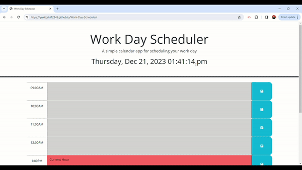

# Work Day Scheduler
Take control of your day with this hourly calendar planner! Each hour from 9am to 5pm is visualised for easy scheduling. Past blocks are subtle gray, the present glows red, and future hours await in vibrant green. Save events in any block and clear them all with a single click.

## Table of Contents

- [User Story](#user-story)
- [Objectives](#objectives)
- [Technologies And Tools Used](#technologies-and-tools-used)
- [Video](#video)
- [Explanation of Video](#explanation-of-video)
- [Output](#output)
- [Installation](#installation)
- [Central Grader Comments](#central-grader-comments)
- [License](#license)

## User Story

```md
AS AN employee with a busy schedule
I WANT to add important events to a daily planner
SO THAT I can manage my time effectively
```

## Objectives
The following criteria has to be met:

- Upon opening, the planner highlights the current day at the top for quick reference.
- Visualise your day with standard business hours (9am-5pm) clearly  segmented into timeblocks.
- Colour-coded timeblocks instantly shows what's been, what's happening, and what's to come.
- Click any block to effortlessly add an event and fill in the details.
- Local storage ensures your plans stays put, even when you refresh the page.
- Your crafted schedule won't disappear when the page refreshes.

## Technologies and Tools Used
- HTML
- CSS
- JavaScript
- Bootstrap
- Day js

## Video



## Output

The Work Day Scheduler plans your day with ease: visualise your schedule, add events, and keep it all saved, even when you refresh the page.

## Installation
The project was uploaded to [GitHub](https://github.com/) at the following repository:
[https://github.com/yukitoshi12345/Work-Day-Scheduler](https://github.com/yukitoshi12345/Work-Day-Scheduler)

You can access the deployed application with the GitHub Pages link:
[https://yukitoshi12345.github.io/Work-Day-Scheduler/](https://yukitoshi12345.github.io/Work-Day-Scheduler/)

## Central Grader Comments
Grade: 100/100

Marker 1 - Thank you for the submission, congratulations on an outstanding job with this week’s challenge! You successfully demonstrated your ability to build a dynamic day planner that’s powered by your Javascript code!

Nice work deploying the site and submitting the correct links, both your repo and live site look great. Excellent job getting the current date and time to display! Also, nice work ensuring your time blocks change color based on the time of day - you did a nice job making the site polished and professional. Additionally, the save buttons look great, fantastic job getting the local storage up and running.

You also did a wonderful job making descriptive commits to your repo and commenting out quality notes in your code! These are great habits to develop early in your coding journey. Your Readme file is also well done- your description is well written and the link to the deployed site works well. With this being said Yukitoshi, your efforts and attention to detail with this day planner have not gone unnoticed.

Keep up the hard work, and happy coding!

- Respectfully, Central Grader ID. 

Marker 2 - You have demonstrated an impressive proficiency in swiftly grasping and leveraging Third Party APIs to streamline the codebase. By seamlessly integrating DayJS, you have effectively managed dates and time, ensuring accurate functionality throughout your codebase. Additionally, your skillful use of jQuery has facilitated seamless DOM manipulation and event handling, greatly enhancing the interactivity and responsiveness of your application. The adept utilization of DayJS and jQuery showcases the immense benefits they bring to your work.

Moreover, you have showcased your strong foundation in JavaScript and Web APIs, employing techniques such as for loops, if statements, switch cases, and local storage manipulation to further elevate your work. The seamless integration of third-party resources, Web API, and native JavaScript throughout your project is commendable, reflecting your expertise and versatility.

Furthermore, the detailed pseudocode & descriptive README.md further elevates the repository's accessibility. You've effectively  communicated the capabilities of the workday scheduler, and your skills as a programmer. Well done!

Your delivery of an exceptional frontend application showcases your talent and dedication to users, developers, and potential employers alike. Keep up the outstanding work, and continue honing your skills!

- EE, Centralized Grading

## License
This project is licensed under the [MIT License](https://github.com/Yukitoshi12345/Work-Day-Scheduler/blob/main/LICENSE).

